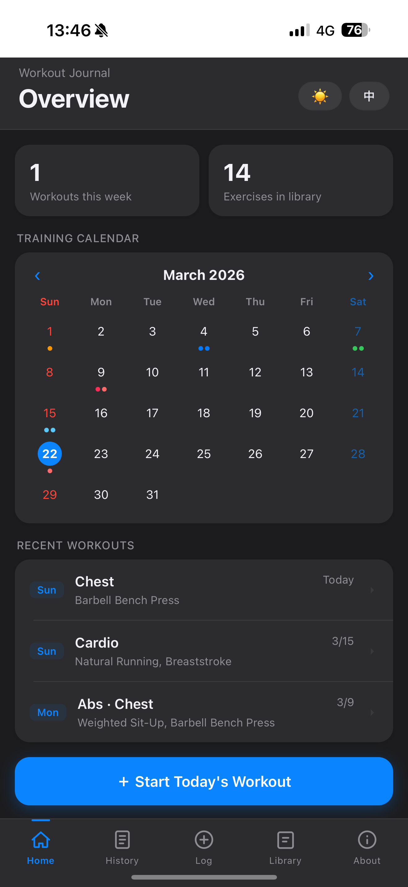
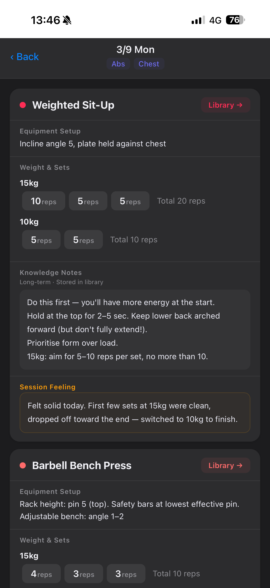
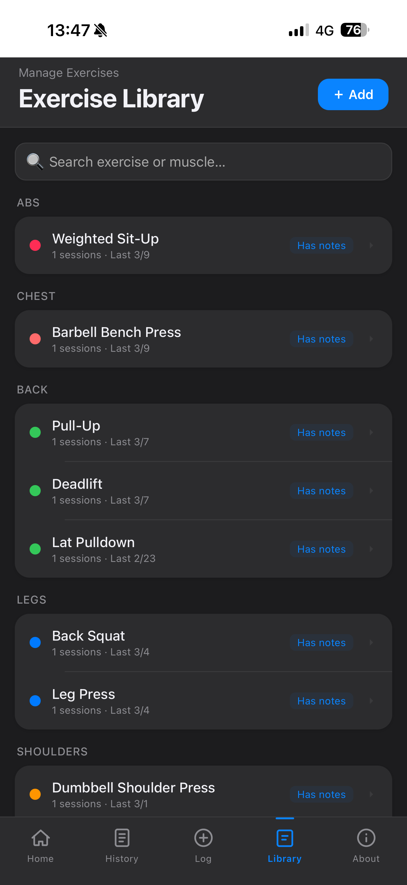
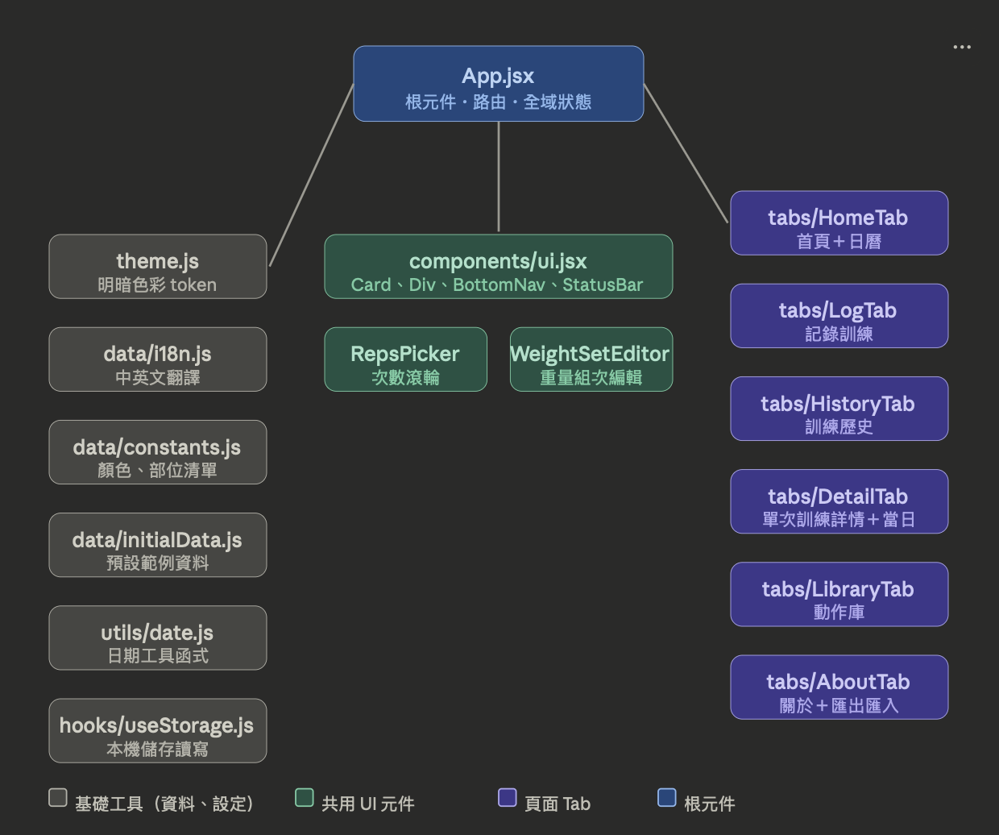

# 💪 GymReco

**A mobile-first PWA workout tracker｜手機優先的健身紀錄 App （漸進式網頁應用程式）**

> Log your workouts, build your exercise library, and track your progress — all stored locally on your device.

> 輕鬆紀錄訓練、管理動作庫、追蹤進度。資料全部存在你的手機本地端。

---

## ✨ Features｜功能

- 📋 Log workouts with weight, sets, reps, and session notes
- 📚 Personal exercise library with knowledge notes
- 📅 Training calendar overview
- 📆 Monthly collapsible history view
- 🌐 Bilingual interface (中文 / English) + Night Mode 🌙
- 💾 Data stored locally via localStorage — no account needed
- 📱 PWA + Service Worker — add to home screen, works offline
- 📤 JSON / CSV export and JSON import

---

## 🚀 Try it now｜立即使用

Open with iPhone Safari or Android Chrome:

👉 **https://rubychenhaii.github.io/workout-tracker**

Then: **Share → Add to Home Screen** for full-screen experience.


請以 iPhone Safari 或 Android Chrome 打開以下連結：

👉 **https://rubychenhaii.github.io/workout-tracker**

接著：分享 → 加入主畫面，以全螢幕使用。原生App體驗！

> ☑️ App 中預設顯示之紀錄為範例資料，請放心將其刪除！
> The workout records shown by default are sample data. Feel free to delete them!

---

## 📸 Screenshots

  

---

## 💾 資料儲存說明｜Data Storage Notice

‼️App 的所有資料儲存於**瀏覽器的 localStorage**，請注意以下情況會導致資料永久消失：

- 在瀏覽器設定中清除「網站資料」或「localStorage」
- 換手機或換瀏覽器（資料不會自動轉移）
- 重灌手機作業系統

請善用「輸出為JSON」功能（位於「關於」頁面）進行存檔/讀檔。

All data is stored in your **browser's localStorage**.
Data will be permanently lost if you clear site data, switch devices, or reinstall your OS.
JSON/CSV export and JSON import are available in the About page. handy for backing up or restoring your data!

> This app intentionally avoids cloud sync, accounts, and external APIs.
> Your data is yours — stored locally, fully offline-capable, and never leaves your device.

---

## 📋 Changelog｜版本紀錄

**v1.8.0**
- Refactored entire codebase from a single 1,700-line file into modular components
- Fixed session ordering and exercise display order in history
- Library item detail: last equipment and sets are now read-only (no accidental overwrites)
- Detail view: single-layered UI, delete button moved to header
- Monthly collapsible sections in History tab
- Strengthened JSON import validation
- Full i18n audit: all UI strings now go through the translation system

**v1.6.0**
- JSON/CSV export and JSON import (About page)

**v1.0–1.5**
- Initial build, feature expansion, PWA deployment, security hardening

---

## 🛠️ Local Development｜本機開發
```bash
git clone https://github.com/rubychenhaii/workout-tracker.git
cd workout-tracker
npm install
npm start
```

To deploy:
```bash
npm run deploy
```

---

## 📦 Tech Stack｜技術

- React 19
- PWA + Service Worker (offline support)
- localStorage (no backend required)
- Deployed via GitHub Pages
- Developed with help from Claude Sonnet 4.6

---

## ⛓️ Architecture｜架構 (v1.8.0 - )



---

## 🤖 Development Story｜開發歷程

This project was developed entirely through AI-assisted development using Claude Sonnet 4.6, without writing a single line of code manually.

Human role:
- Product design
- UX decisions
- Testing & iteration

AI role:
- Code generation
- Debugging
- Refactoring support

The development process unfolded across several days of iterative prompting:

**Day 1 — Prototype**
Starting from a simple idea — replacing an iPhone Notes workout log - the first React prototype was generated through a series of prompts describing the desired UI, data structure, and interaction patterns.

**Day 2 — Feature Expansion**
The app gained a full exercise library system with persistent knowledge notes, a training calendar, bilingual (zh/EN) support, colour token system, and a bottom navigation bar.

**Day 3 — Deployment**
The app was deployed to GitHub Pages as a PWA via step-by-step prompting through the entire toolchain: Node.js, Create React App, gh-pages, Git, and Netlify.

**Day 4 — Hardening**
A collaborative security and functionality audit surfaced, and were all resolved: ID collision risks, date sorting bugs, i18n gaps, routing issues, and iOS PWA incompatibilities. All were fixed through targeted prompts.

**Day 5 & counting — Refactor & Bug Fixes**
v1.8.0: The entire 1,700-line codebase was modularised into 13 focused files. Five bugs were fixed (session ordering, display logic, read-only library fields, single-layer detail view). A full security audit was conducted, and monthly collapsible history was added.

---

## 👤 Author｜作者

**Ruby Chen**
GitHub: [@rubychenhaii](https://github.com/rubychenhaii)

---

## 📄 License

MIT © 2026 Ruby Chen
